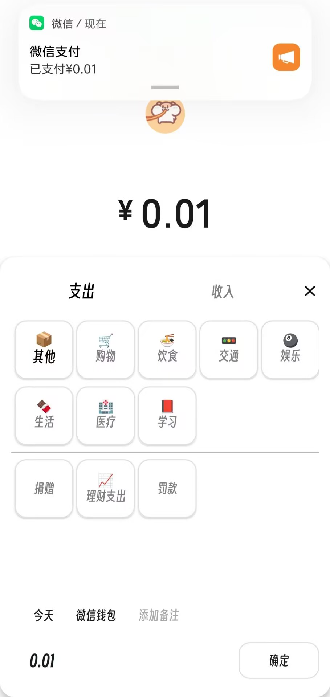

# 不想记账 - 官方发布页

[点击下载](https://gitee.com/xhh425/o-o-app-update/releases/download/v1.0.7/不想记账_v1.0.7.apk)

一款基于 Android 的本地自动化记账 App

## 支持的记账方式

- 无感记账
- 弹窗记账
- 手动记账

## 支持的平台 & 场景

- 支付宝（支付、收款、退款）
- 微信（支付、收款）

## AI 账单总结

- 接入 DeepSeek，可自定义 prompt

## 自动记账基于读取通知内容实现

- 无需读取屏幕内容&本地部署
- 除 DeepSeek 服务外，所有数据均本地处理，不会上传。

## 自动记账所需权限

- 通知使用权
- 允许通知
- 悬浮窗
- 后台弹出界面
- 后台运行

|  |  |  |
| ------------------------------------------------- | ------------------------------------------------- | ----------------------------------------- |
|          |          |  |

